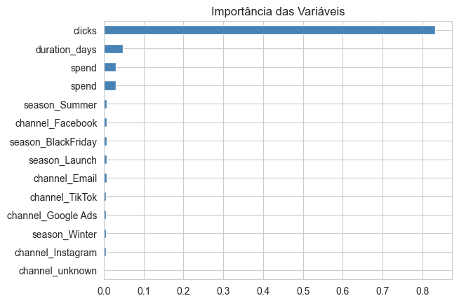

# Previsão de Performance de Campanhas de Publicidade

Este projeto utiliza **Machine Learning** (Random Forest) para prever o número de clientes captados durante campanhas de marketing com base no investimento, canal utilizado e duração, em dias.

## Resultados do Modelo
- **R² Score:** 71% - O modelo tem poder preditivo de 70% dos valores. 
- **Erro Médio (MAE):** 54 conversões - Indica a margem de erro do modelo, para mais ou para menos. 

##  Insights Principais

Conforme analisado no gráfico, as variáveis **Spend**,**duration_days** e **clicks** são os fatores mais decisivos para o sucesso das conversões.

